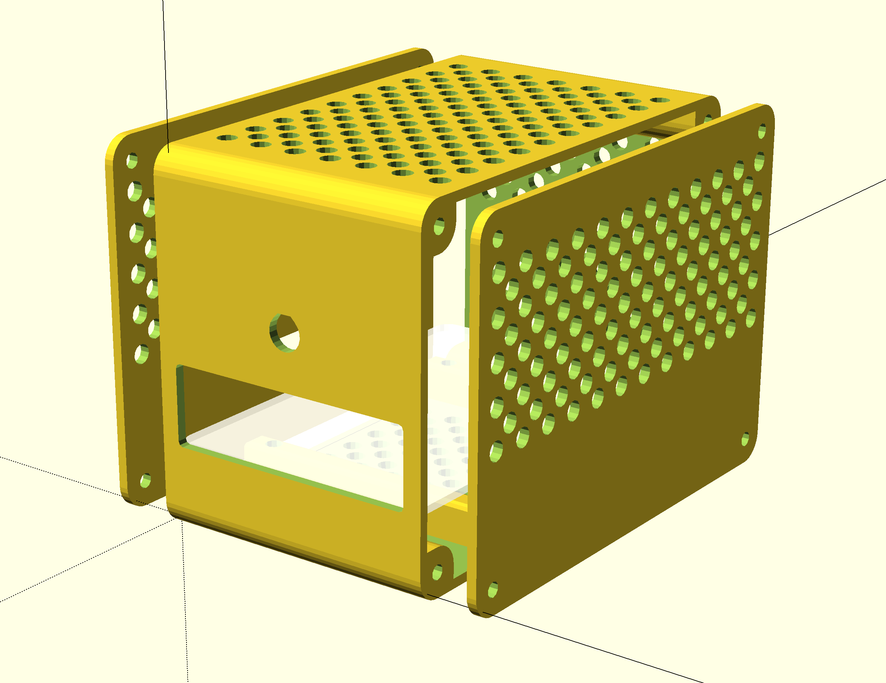
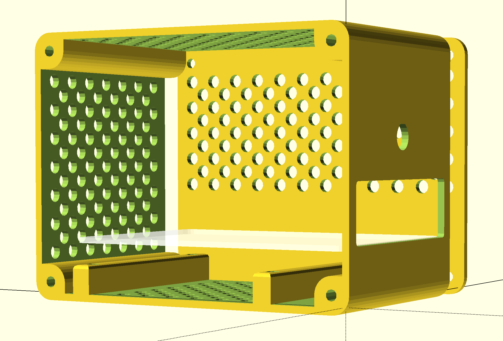
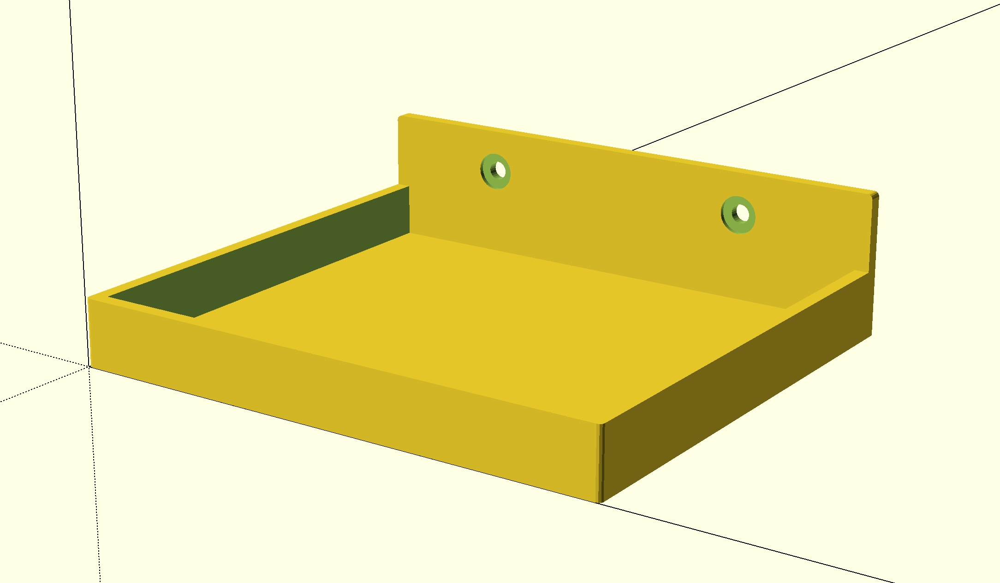
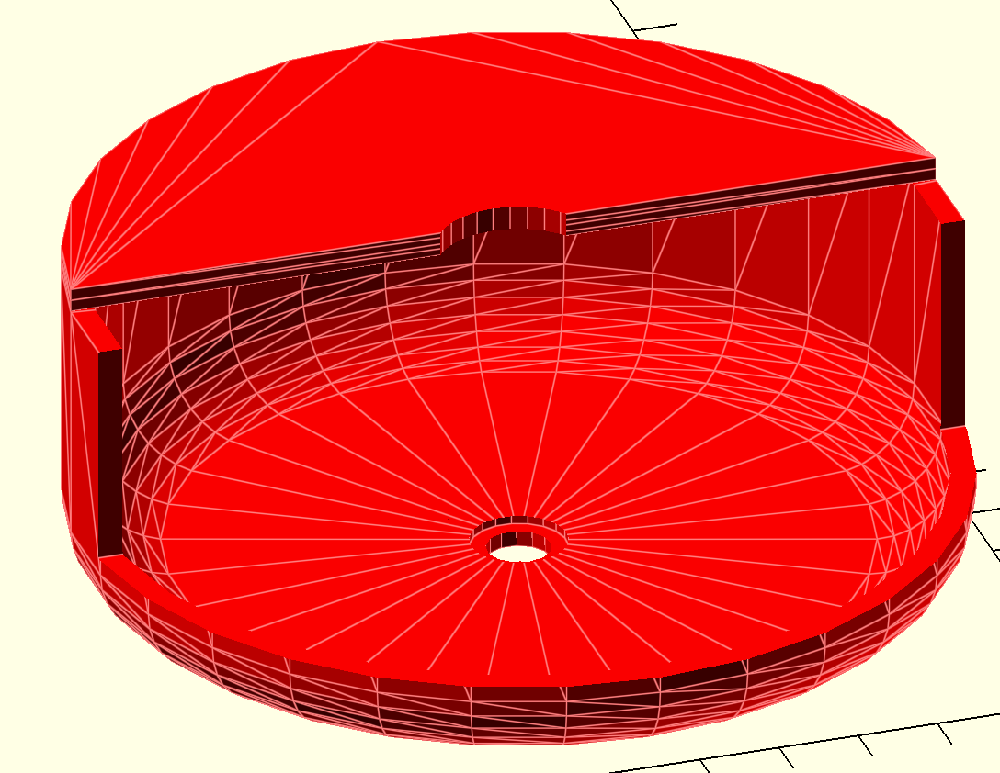
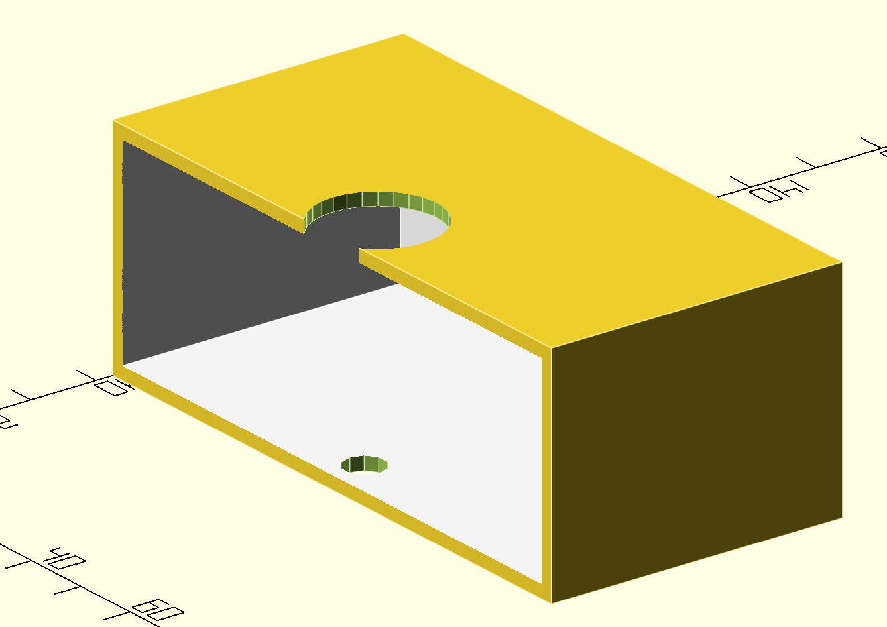
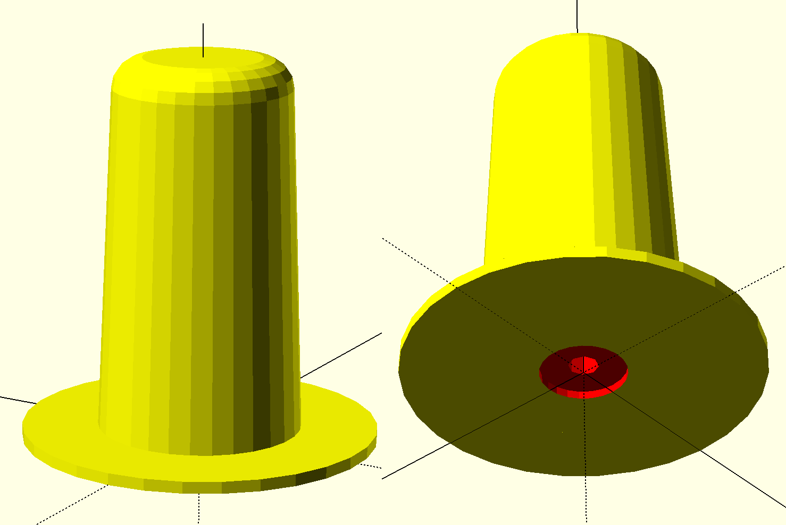
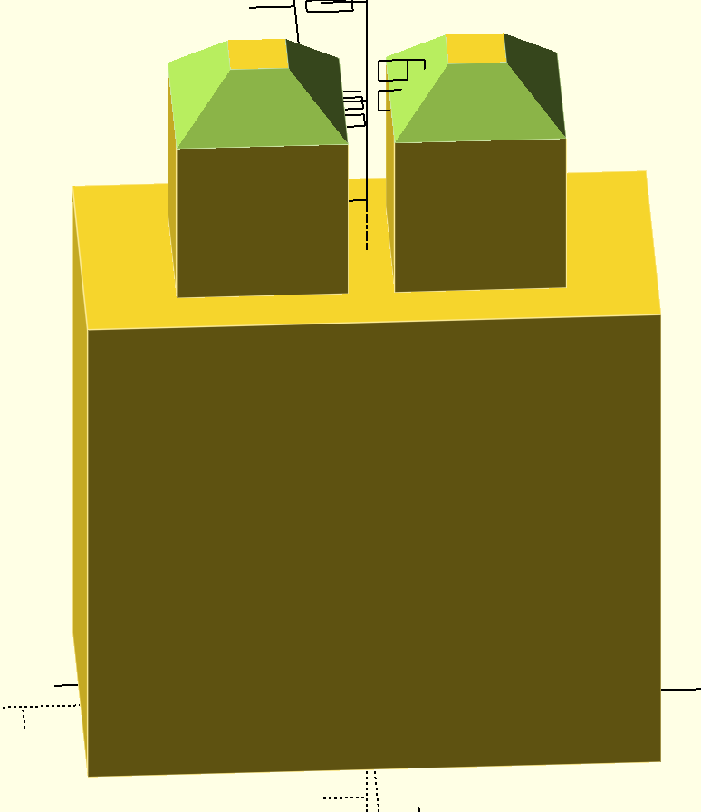

# Personal OpenSCAD projects

## Installation

### Libraries

Followed [this](https://github.com/revarbat/BOSL/wiki) wiki installation guide.

## Projects

### Raspberry Pi 5 case

  

  

### Tahoma shelf

  

### Aqara Hub M2 wall mount

  

### Netatmo relay wall mount

  

### Brother spool holder

  

### Support grille

  

