# Personal OpenSCAD projects

<!-- visual-catalog:start -->
## Visual catalog

<sub>Generated with `make catalog`. Expand a project to browse its printable models.</sub>

<details>
<summary><strong>Arcade</strong> · 2 models</summary>

<table>
<tr>
<td width="50%" align="center">
  <a href="src/arcade/buttons.scad">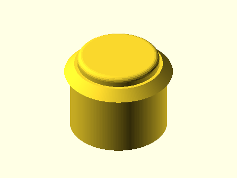</a><br>
  <a href="src/arcade/buttons.scad"><strong>Buttons</strong></a>
</td>
<td width="50%" align="center">
  <a href="src/arcade/controller.scad">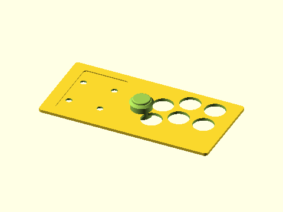</a><br>
  <a href="src/arcade/controller.scad"><strong>Controller</strong></a>
</td>
</tr>
</table>

</details>

<details>
<summary><strong>Aspirateur</strong> · 3 models</summary>

<table>
<tr>
<td width="50%" align="center">
  <a href="src/aspirateur/dewalt-dremel.scad">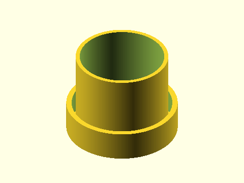</a><br>
  <a href="src/aspirateur/dewalt-dremel.scad"><strong>DeWalt Dremel</strong></a>
</td>
<td width="50%" align="center">
  <a href="src/aspirateur/dewalt-makita-circulaire.scad">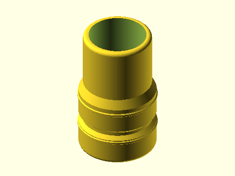</a><br>
  <a href="src/aspirateur/dewalt-makita-circulaire.scad"><strong>DeWalt Makita Circulaire</strong></a>
</td>
</tr>
<tr>
<td width="50%" align="center">
  <a href="src/aspirateur/dewalt-metabo-ponceuse.scad">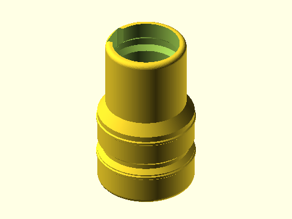</a><br>
  <a href="src/aspirateur/dewalt-metabo-ponceuse.scad"><strong>DeWalt Metabo Ponceuse</strong></a>
</td>
<td width="50%"></td>
</tr>
</table>

</details>

<details>
<summary><strong>Balcon</strong> · 2 models</summary>

<table>
<tr>
<td width="50%" align="center">
  <a href="src/balcon/bouchon-parasol.scad">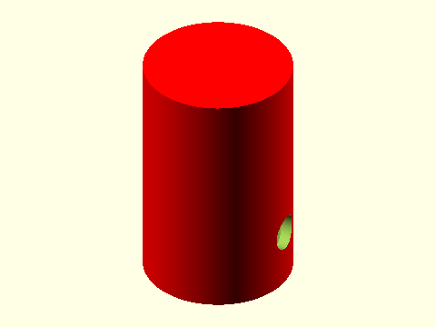</a><br>
  <a href="src/balcon/bouchon-parasol.scad"><strong>Bouchon Parasol</strong></a>
</td>
<td width="50%" align="center">
  <a href="src/balcon/fixation-parasol.scad">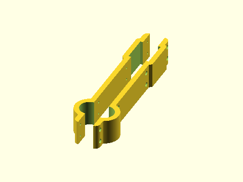</a><br>
  <a href="src/balcon/fixation-parasol.scad"><strong>Fixation Parasol</strong></a>
</td>
</tr>
</table>

</details>

<details>
<summary><strong>Caches</strong> · 3 models</summary>

<table>
<tr>
<td width="50%" align="center">
  <a href="src/caches/cache-cave-vin.scad">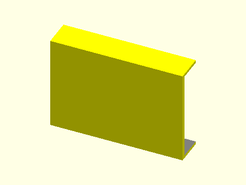</a><br>
  <a href="src/caches/cache-cave-vin.scad"><strong>Cache Cave Vin</strong></a>
</td>
<td width="50%" align="center">
  <a href="src/caches/cache-chargeur-pile.scad">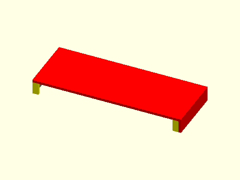</a><br>
  <a href="src/caches/cache-chargeur-pile.scad"><strong>Cache Chargeur Pile</strong></a>
</td>
</tr>
<tr>
<td width="50%" align="center">
  <a href="src/caches/cache-ventilateur.scad">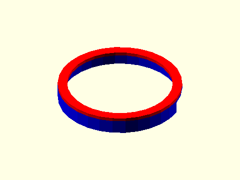</a><br>
  <a href="src/caches/cache-ventilateur.scad"><strong>Cache Ventilateur</strong></a>
</td>
<td width="50%"></td>
</tr>
</table>

</details>

<details>
<summary><strong>Cuisine</strong> · 1 model</summary>

<table>
<tr>
<td width="50%" align="center">
  <a href="src/cuisine/stackable-ikea-citronhaj.scad">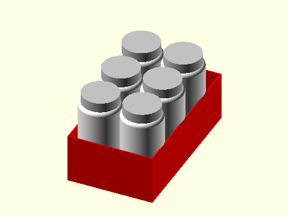</a><br>
  <a href="src/cuisine/stackable-ikea-citronhaj.scad"><strong>Stackable IKEA Citronhaj</strong></a>
</td>
<td width="50%"></td>
</tr>
</table>

</details>

<details>
<summary><strong>Gabarit</strong> · 1 model</summary>

<table>
<tr>
<td width="50%" align="center">
  <a href="src/gabarit/poignee-ikea.scad">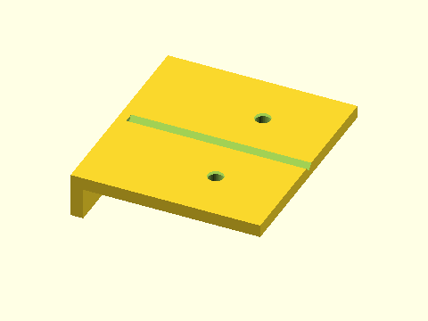</a><br>
  <a href="src/gabarit/poignee-ikea.scad"><strong>Poignee IKEA</strong></a>
</td>
<td width="50%"></td>
</tr>
</table>

</details>

<details>
<summary><strong>Microlab</strong> · 2 models</summary>

<table>
<tr>
<td width="50%" align="center">
  <a href="src/microlab/modules/homeassistant.scad">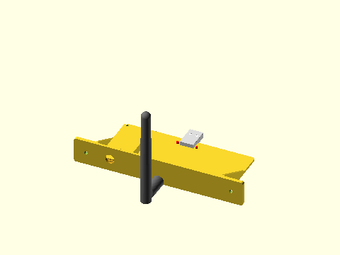</a><br>
  <a href="src/microlab/modules/homeassistant.scad"><strong>Modules · Home Assistant</strong></a>
</td>
<td width="50%" align="center">
  <a href="src/microlab/peripherals/sonoff.scad">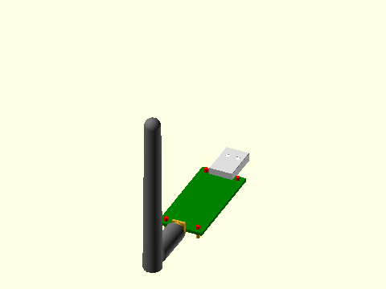</a><br>
  <a href="src/microlab/peripherals/sonoff.scad"><strong>Peripherals · Sonoff</strong></a>
</td>
</tr>
</table>

</details>

<details>
<summary><strong>Mistral</strong> · 1 model</summary>

<table>
<tr>
<td width="50%" align="center">
  <a href="src/mistral/logo.scad">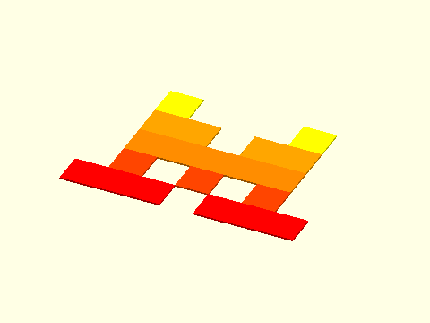</a><br>
  <a href="src/mistral/logo.scad"><strong>Logo</strong></a>
</td>
<td width="50%"></td>
</tr>
</table>

</details>

<details>
<summary><strong>Old Arcade</strong> · 10 models</summary>

<table>
<tr>
<td width="50%" align="center">
  <a href="src/old-arcade/arcade.scad">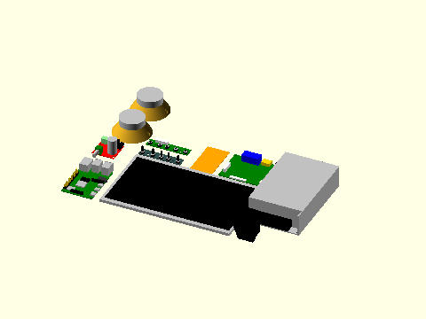</a><br>
  <a href="src/old-arcade/arcade.scad"><strong>Arcade</strong></a>
</td>
<td width="50%" align="center">
  <a href="src/old-arcade/audio_card.scad">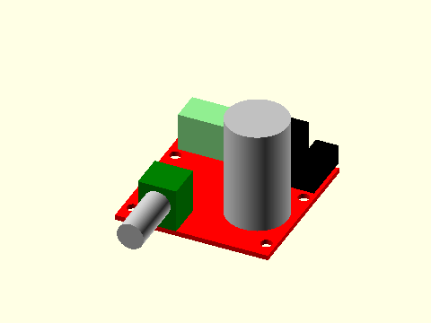</a><br>
  <a href="src/old-arcade/audio_card.scad"><strong>Audio Card</strong></a>
</td>
</tr>
<tr>
<td width="50%" align="center">
  <a href="src/old-arcade/case.scad">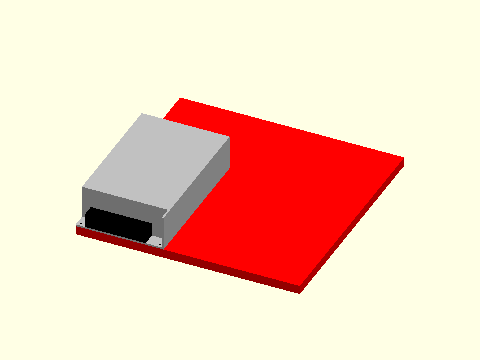</a><br>
  <a href="src/old-arcade/case.scad"><strong>Case</strong></a>
</td>
<td width="50%" align="center">
  <a href="src/old-arcade/power_socket.scad">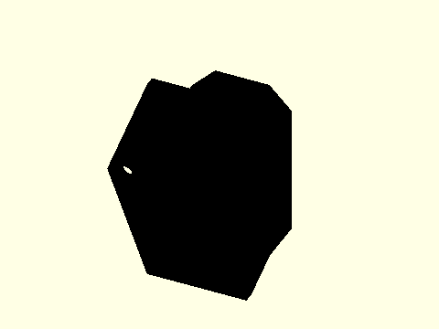</a><br>
  <a href="src/old-arcade/power_socket.scad"><strong>Power Socket</strong></a>
</td>
</tr>
<tr>
<td width="50%" align="center">
  <a href="src/old-arcade/power_supply.scad">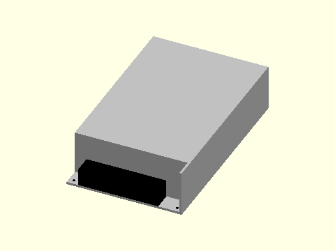</a><br>
  <a href="src/old-arcade/power_supply.scad"><strong>Power Supply</strong></a>
</td>
<td width="50%" align="center">
  <a href="src/old-arcade/rpi4_b.scad">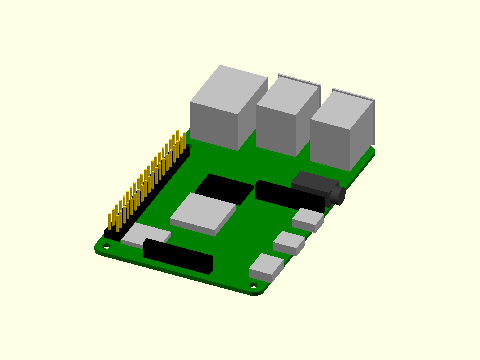</a><br>
  <a href="src/old-arcade/rpi4_b.scad"><strong>Raspberry Pi 4 B</strong></a>
</td>
</tr>
<tr>
<td width="50%" align="center">
  <a href="src/old-arcade/screen.scad">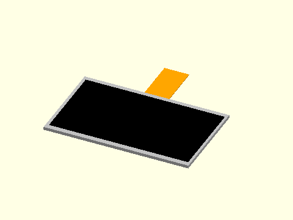</a><br>
  <a href="src/old-arcade/screen.scad"><strong>Screen</strong></a>
</td>
<td width="50%" align="center">
  <a href="src/old-arcade/screen_control.scad">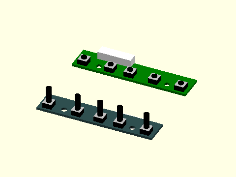</a><br>
  <a href="src/old-arcade/screen_control.scad"><strong>Screen Control</strong></a>
</td>
</tr>
<tr>
<td width="50%" align="center">
  <a href="src/old-arcade/speaker.scad">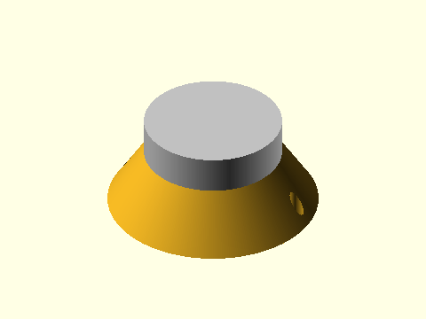</a><br>
  <a href="src/old-arcade/speaker.scad"><strong>Speaker</strong></a>
</td>
<td width="50%" align="center">
  <a href="src/old-arcade/video_card.scad">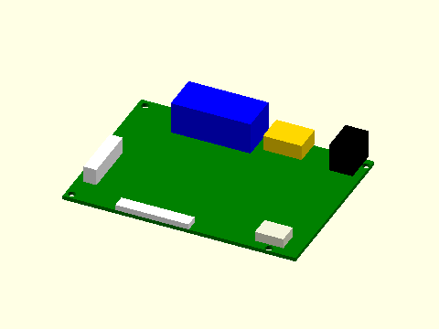</a><br>
  <a href="src/old-arcade/video_card.scad"><strong>Video Card</strong></a>
</td>
</tr>
</table>

</details>

<details>
<summary><strong>Pelle Goutiere</strong> · 1 model</summary>

<table>
<tr>
<td width="50%" align="center">
  <a href="src/pelle-goutiere/pelle-goutiere.scad">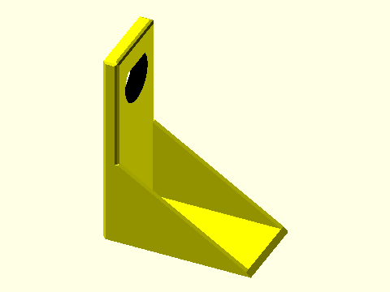</a><br>
  <a href="src/pelle-goutiere/pelle-goutiere.scad"><strong>Pelle Goutiere</strong></a>
</td>
<td width="50%"></td>
</tr>
</table>

</details>

<details>
<summary><strong>Porte Bobine</strong> · 2 models</summary>

<table>
<tr>
<td width="50%" align="center">
  <a href="src/porte-bobine/brother-spool-holder-catherine.scad">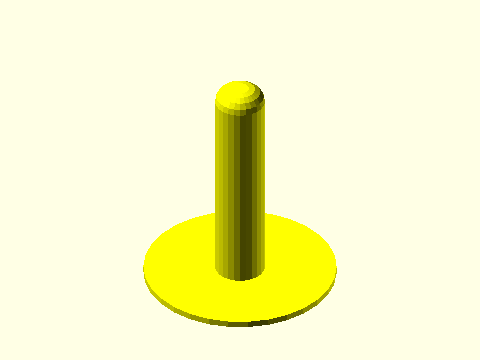</a><br>
  <a href="src/porte-bobine/brother-spool-holder-catherine.scad"><strong>Brother Spool Holder Catherine</strong></a>
</td>
<td width="50%" align="center">
  <a href="src/porte-bobine/brother-spool-holder.scad">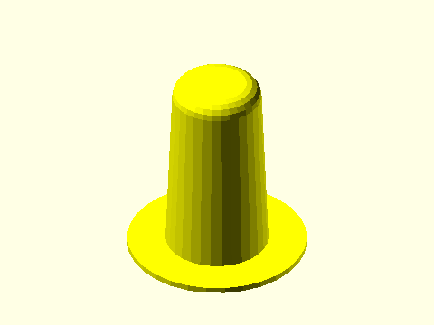</a><br>
  <a href="src/porte-bobine/brother-spool-holder.scad"><strong>Brother Spool Holder</strong></a>
</td>
</tr>
</table>

</details>

<details>
<summary><strong>Raspberry Pi 5 Case</strong> · 1 model</summary>

<table>
<tr>
<td width="50%" align="center">
  <a href="src/rpi5-case/rpi5-case.scad">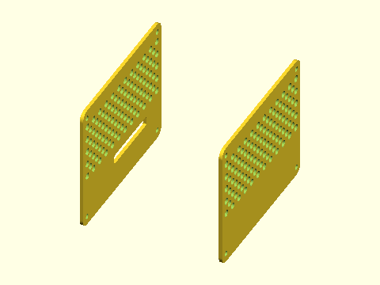</a><br>
  <a href="src/rpi5-case/rpi5-case.scad"><strong>Raspberry Pi 5 Case</strong></a>
</td>
<td width="50%"></td>
</tr>
</table>

</details>

<details>
<summary><strong>Score Babyfoot</strong> · 1 model</summary>

<table>
<tr>
<td width="50%" align="center">
  <a href="src/score-babyfoot/score-babyfoot.scad">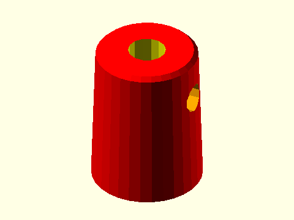</a><br>
  <a href="src/score-babyfoot/score-babyfoot.scad"><strong>Score Babyfoot</strong></a>
</td>
<td width="50%"></td>
</tr>
</table>

</details>

<details>
<summary><strong>Sonos</strong> · 1 model</summary>

<table>
<tr>
<td width="50%" align="center">
  <a href="src/sonos/roam-bathroom-support.scad">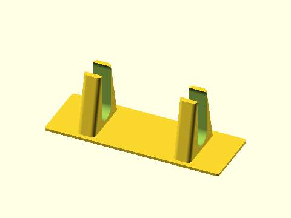</a><br>
  <a href="src/sonos/roam-bathroom-support.scad"><strong>Roam Bathroom Support</strong></a>
</td>
<td width="50%"></td>
</tr>
</table>

</details>

<details>
<summary><strong>Supports</strong> · 2 models</summary>

<table>
<tr>
<td width="50%" align="center">
  <a href="src/supports/aqara-hub-m2.scad">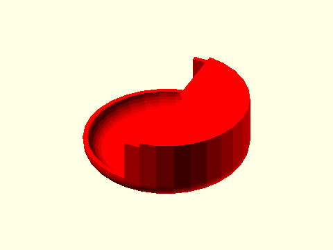</a><br>
  <a href="src/supports/aqara-hub-m2.scad"><strong>Aqara Hub M2</strong></a>
</td>
<td width="50%" align="center">
  <a href="src/supports/netatmo-relay-wall-mount.scad">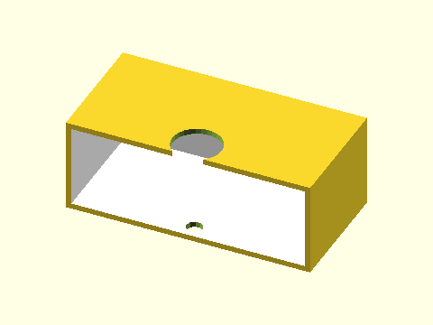</a><br>
  <a href="src/supports/netatmo-relay-wall-mount.scad"><strong>Netatmo Relay Wall Mount</strong></a>
</td>
</tr>
</table>

</details>

<details>
<summary><strong>Table Basse</strong> · 3 models</summary>

<table>
<tr>
<td width="50%" align="center">
  <a href="src/table-basse/pieds.scad">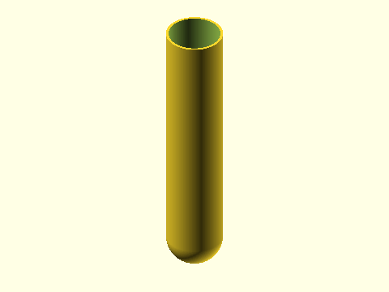</a><br>
  <a href="src/table-basse/pieds.scad"><strong>Pieds</strong></a>
</td>
<td width="50%" align="center">
  <a href="src/table-basse/poignee.scad">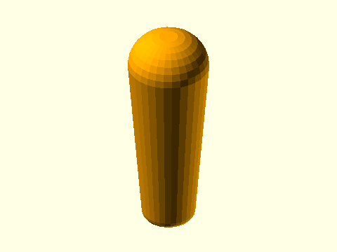</a><br>
  <a href="src/table-basse/poignee.scad"><strong>Poignee</strong></a>
</td>
</tr>
<tr>
<td width="50%" align="center">
  <a href="src/table-basse/roulement.scad">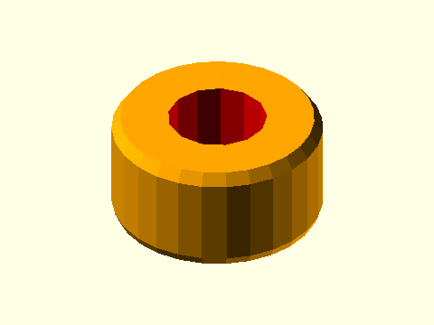</a><br>
  <a href="src/table-basse/roulement.scad"><strong>Roulement</strong></a>
</td>
<td width="50%"></td>
</tr>
</table>

</details>

<details>
<summary><strong>Tahoma</strong> · 1 model</summary>

<table>
<tr>
<td width="50%" align="center">
  <a href="src/tahoma/tahoma-shelf.scad">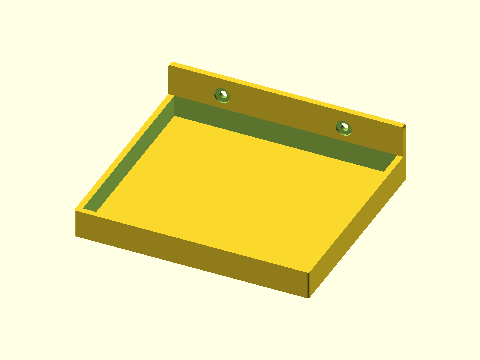</a><br>
  <a href="src/tahoma/tahoma-shelf.scad"><strong>Tahoma Shelf</strong></a>
</td>
<td width="50%"></td>
</tr>
</table>

</details>

<details>
<summary><strong>Trappe Ski</strong> · 1 model</summary>

<table>
<tr>
<td width="50%" align="center">
  <a href="src/trappe-ski/trappe-ski.scad">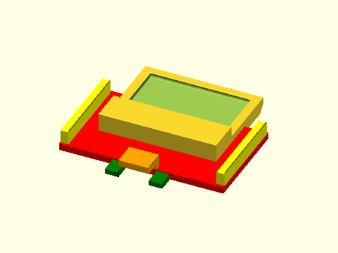</a><br>
  <a href="src/trappe-ski/trappe-ski.scad"><strong>Trappe Ski</strong></a>
</td>
<td width="50%"></td>
</tr>
</table>

</details>
<!-- visual-catalog:end -->

## Development notes

### Prerequisites

Install OpenSCAD and make its CLI available as `openscad`. The repository pins
its BOSL v1 and BOSL2 dependencies as submodules, so a fresh clone only needs:

```sh
make bootstrap
make doctor
```

`make bootstrap` initializes the pinned libraries under `vendor/`; the
repository commands add that directory to `OPENSCADPATH` automatically.


### Organization

- `src/_lib/` contains shared, responsibility-named modules.
  `src/_lib/print-settings.scad`
  is the single source of truth for the common render quality and BOSL2 `$slop`
  defaults.
- Each project lives under `src/<project>/`. A project gets a `config.scad`
  only when it has real project-wide overrides or parameters; for example,
  `src/aspirateur/config.scad` changes the preview resolution and fit tolerance for
  the whole adapter family.
- Keep dimensions that belong to a single part next to that part. Move a value
  into a project `config.scad` only once more than one file needs it; move it
  into `src/_lib/` only when several projects need the same rule.
- Do not introduce generic `constants.scad` files. Name the module for its
  responsibility, such as `print-settings.scad`, `fasteners.scad`, or
  `profiles.scad`.

#### Adding a BOSL2 model

Use the shared defaults directly when no project-specific settings are needed:

```scad
include <BOSL2/std.scad>
include <../_lib/print-settings.scad>
```

For a project with an override, include the project configuration instead:

```scad
include <BOSL2/std.scad>
include <config.scad>
```

### Development

OpenSCAD must be available as `openscad` on `PATH` (or supplied through
`OPENSCAD_BIN`). The repository pins legacy BOSL and BOSL2 as submodules;
initialize them once after cloning. Repository-local commands keep checks and
generated exports consistent:

```sh
make bootstrap
make doctor
make models
make check MODEL=src/rpi5-case/rpi5-case.scad
make export MODEL=src/rpi5-case/rpi5-case.scad FORMAT=stl
make catalog
```

Exports are written below `build/`, which is ignored by Git. The agent workflow
and OpenSCAD/BOSL2 conventions are defined in [`AGENTS.md`](AGENTS.md).
