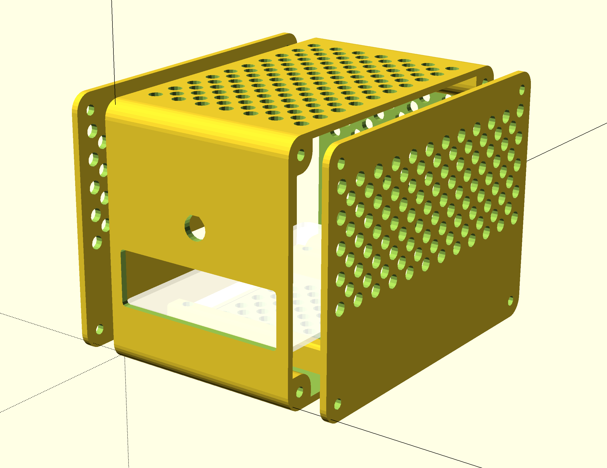
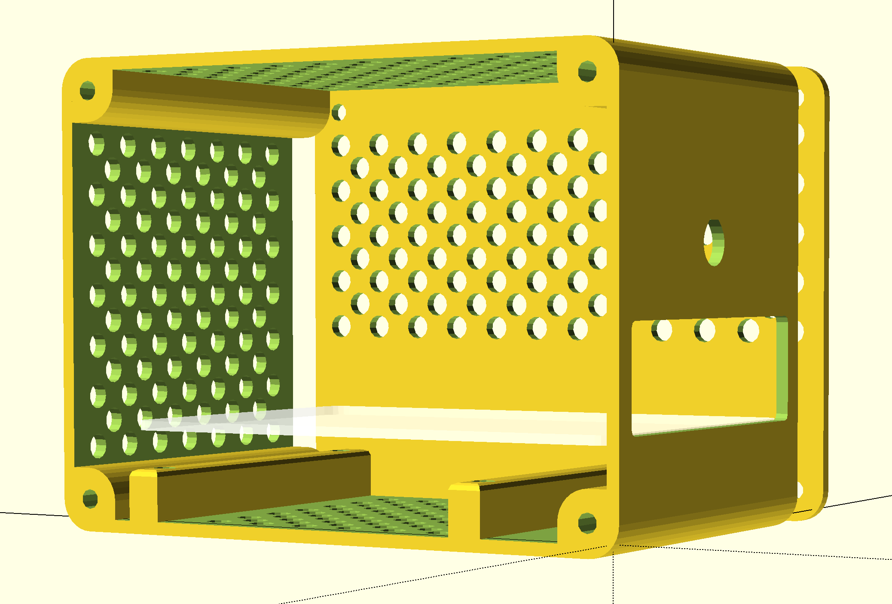
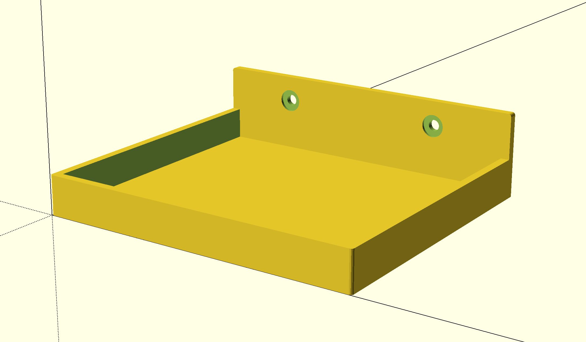
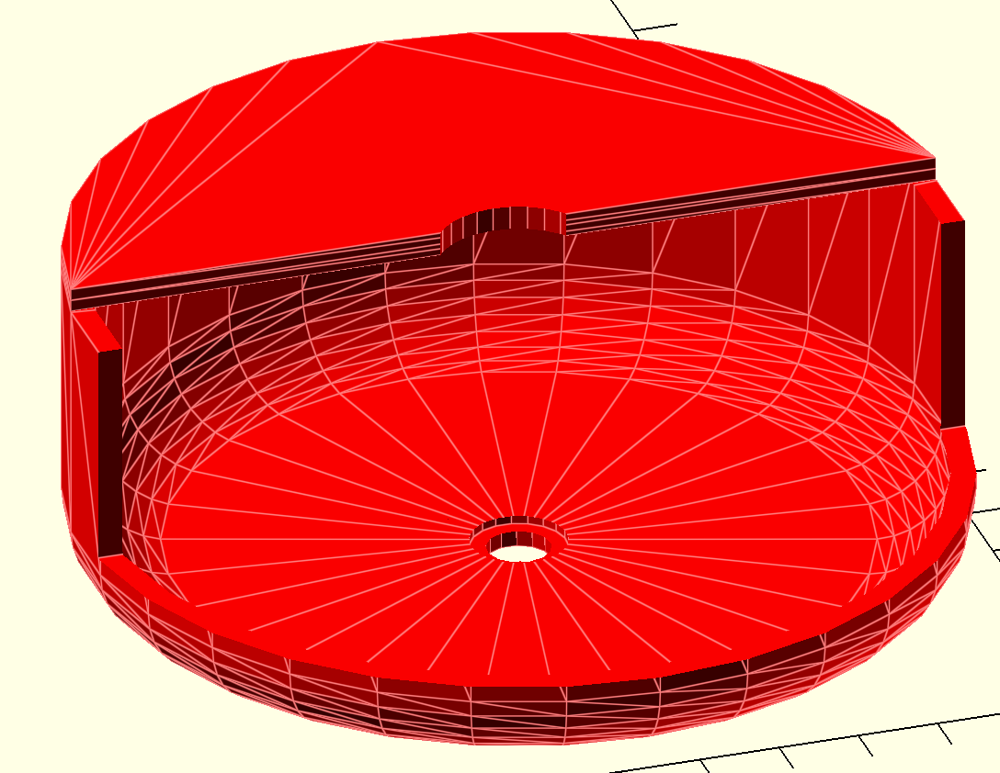
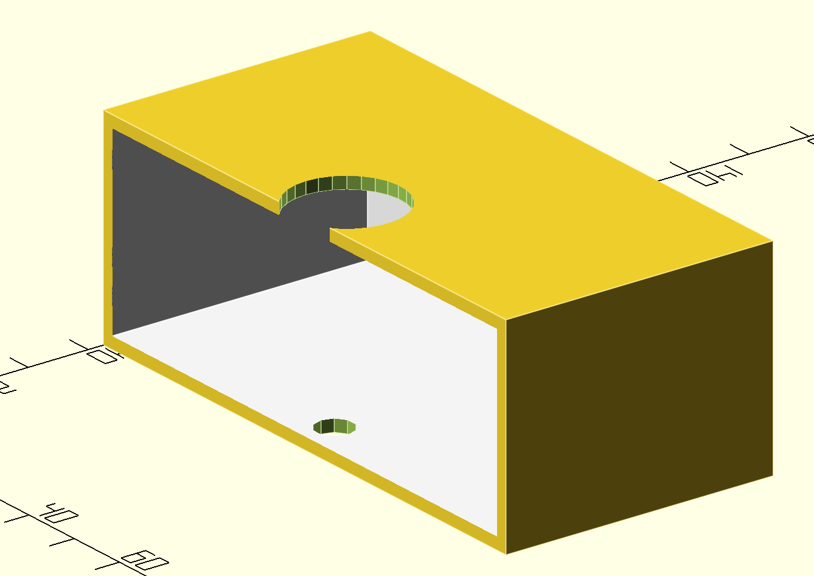
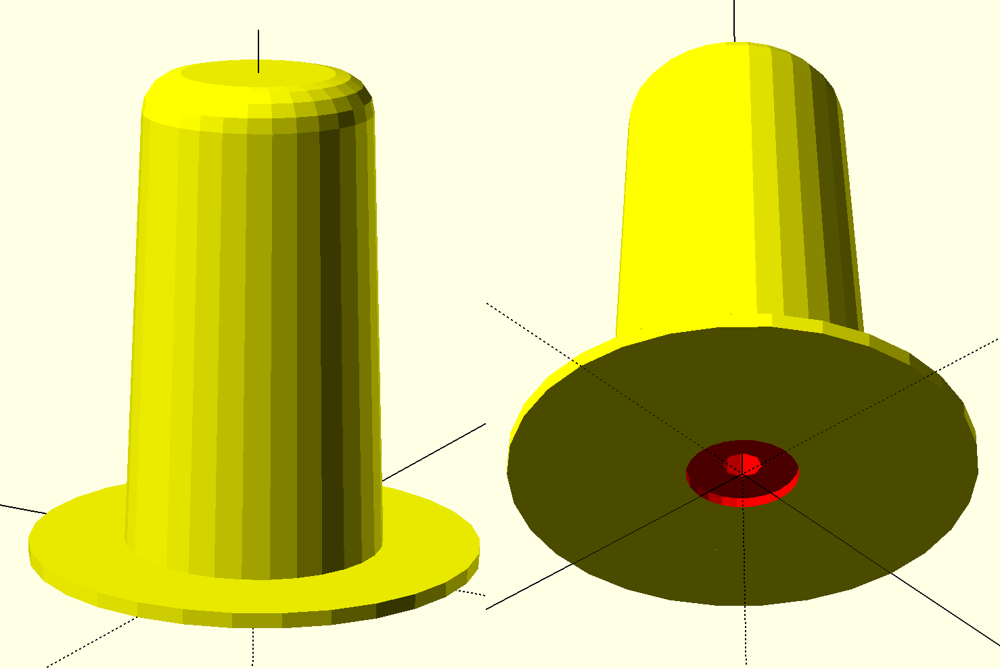
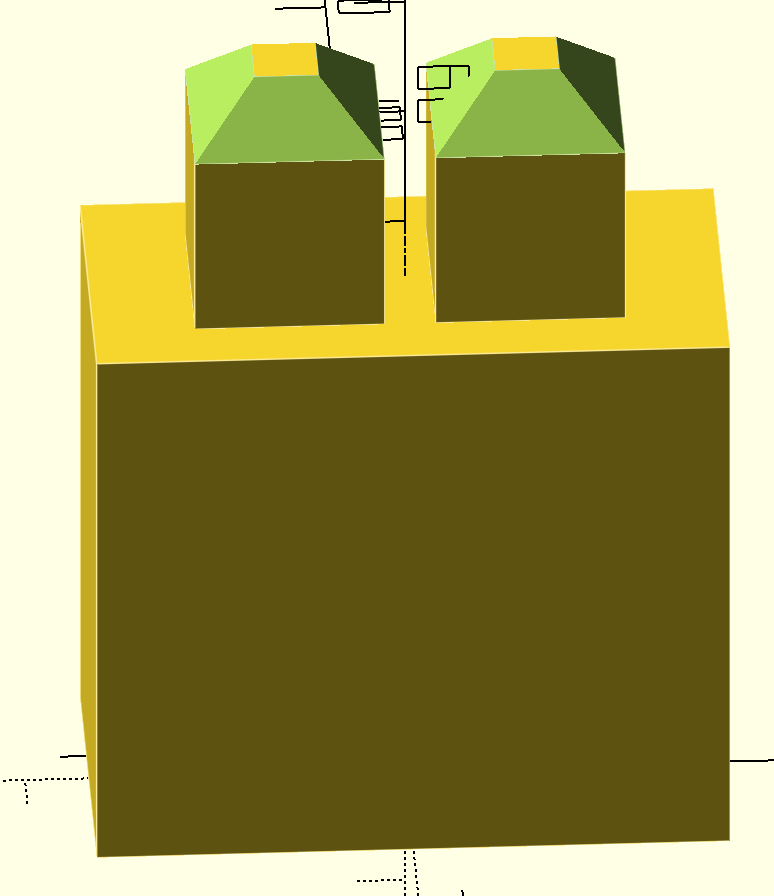

# Personal OpenSCAD projects

## Prerequisites

Install OpenSCAD and make its CLI available as `openscad`. The repository pins
its BOSL v1 and BOSL2 dependencies as submodules, so a fresh clone only needs:

```sh
make bootstrap
make doctor
```

`make bootstrap` initializes the pinned libraries under `vendor/`; the
repository commands add that directory to `OPENSCADPATH` automatically.


## Organization

- `src/lib/` contains shared, responsibility-named modules.
  `src/lib/print-settings.scad`
  is the single source of truth for the common render quality and BOSL2 `$slop`
  defaults.
- Each project lives under `src/<project>/`. A project gets a `config.scad`
  only when it has real project-wide overrides or parameters; for example,
  `src/aspirateur/config.scad` changes the preview resolution and fit tolerance for
  the whole adapter family.
- Keep dimensions that belong to a single part next to that part. Move a value
  into a project `config.scad` only once more than one file needs it; move it
  into `src/lib/` only when several projects need the same rule.
- Do not introduce generic `constants.scad` files. Name the module for its
  responsibility, such as `print-settings.scad`, `fasteners.scad`, or
  `profiles.scad`.

### Adding a BOSL2 model

Use the shared defaults directly when no project-specific settings are needed:

```scad
include <BOSL2/std.scad>
include <../lib/print-settings.scad>
```

For a project with an override, include the project configuration instead:

```scad
include <BOSL2/std.scad>
include <config.scad>
```

## Development

OpenSCAD must be available as `openscad` on `PATH` (or supplied through
`OPENSCAD_BIN`). The repository pins legacy BOSL and BOSL2 as submodules;
initialize them once after cloning. Repository-local commands keep checks and
generated exports consistent:

```sh
make bootstrap
make doctor
make models
make check MODEL=src/rpi5-case/rpi5-case.scad
make export MODEL=src/rpi5-case/rpi5-case.scad FORMAT=stl
```

Exports are written below `build/`, which is ignored by Git. The agent workflow
and OpenSCAD/BOSL2 conventions are defined in [`AGENTS.md`](AGENTS.md).

## Projects

### Raspberry Pi 5 case

<p align="center">
  
</p>

<p align="center">
  
</p>

### Tahoma shelf

<p align="center">
  
</p>

### Aqara Hub M2 wall mount

<p align="center">
  
</p>

### Netatmo relay wall mount

<p align="center">
  
</p>

### Brother spool holder

<p align="center">
  
</p>

### Support grille

<p align="center">
  
</p>
